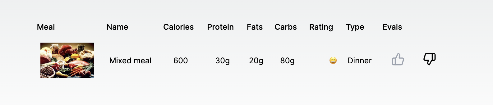
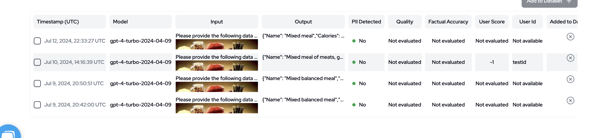

# evaluate-llm

Example NextJS project with React component for scoring LLM responses with Langtrace.ai.

## How it Works

The Feedback component allows users to provide feedback on LLM responses by simply clicking the thumbs up or thumbs down icon. When a user interacts with the component, it sends feedback to Langtrace.ai, which helps track and evaluate the performance of LLM applications. The feedback includes user-specific details like userId, userScore, traceId, and spanId, ensuring precise tracking and analysis.

The backend function handles the feedback submission, sending the data to Langtrace.ai's API using the Langtrace TypeScript SDK. This seamless integration ensures that user feedback is recorded and can be analyzed for improving the LLM's responses.

## How to Get Started

### Step 1: Sign Up at Langtrace.ai

Visit Langtrace.ai and sign up for an account. Once registered, create a new project and generate an API key for your project.

### Step 2: Add your API Keys

In the `/app/api/upload/route.ts` file add your Langtrace API key and your OpenAI API key.

### Step 3: Run the NextJS Application

Run `npm i` to install all dependencies.

Run `npm run dev` to run the NextJS project. You can view the application at `http://localhost:3000`

### Step 4: Test the upload and feedback capabilites.

Upload a photo of your favorite meal by selecting a file or dropping in a jpeg. Then select `Upload Meal`.

After a few seconds, you will see the nutrition information for the uploaded meal. You can view the traces, metrics, and evaluations by navigating to langtrace.ai and selecting the project whose API key you are using.

Finally, click on either the Thumbs Up or Thumbs Down icon within the web application to evaluate the LLM response. You can view the user feedback by navigating to the `/annotations` page within Langtrace.ai and viewing the `User Score` column.

### Note

If you are looking to use any features of this project they are located in the following:

- React component for sending feedback: `/components/shared/evals.tsx`
- API route for calling OpenAI API and sending trace to Langtrace Cloud: `/app/api/upload/route.ts`
- API route for sending user feedback: `/app/api/feedback/route.ts`

Evaluation in action:

Evaluation seen in Langtrace.ai:

