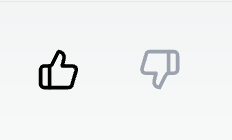

# evaluate-llm



Example React component for scoring LLM responses with Langtrace.ai.

## How it Works

The Feedback component allows users to provide feedback on LLM responses by simply clicking the thumbs up or thumbs down icon. When a user interacts with the component, it sends feedback to Langtrace.ai, which helps track and evaluate the performance of LLM applications. The feedback includes user-specific details like userId, userScore, traceId, and spanId, ensuring precise tracking and analysis.

The backend function handles the feedback submission, sending the data to Langtrace.ai's API using the Langtrace TypeScript SDK. This seamless integration ensures that user feedback is recorded and can be analyzed for improving the LLM's responses.

## How to Get Started

### Step 1: Sign Up at Langtrace.ai

Visit Langtrace.ai and sign up for an account. Once registered, create a new project and generate an API key for your project.

### Step 2: Install the SDK

Install the Langtrace TypeScript SDK in your project:

```
npm i @langtrase/typescript-sdk
```

```javascript
// Must precede any llm module imports
import * as Langtrace from "@langtrase/typescript-sdk";

Langtrace.init({ api_key: "<LANGTRACE_API_KEY>" });
```

### Step 3: Implement the Feedback component

Copy and paste the react component found in **react-component/feedback.tsx**

### Step 4: Create function/API to handle sending user feedback

If you are running a NextJS application, you can copy and paste the API in **example-nextjs-api/route.ts**

### Step 5: Run your application and view your evaluations in Langtrace!

Evaluation in action:


Evaluation seen in Langtrace.ai:

